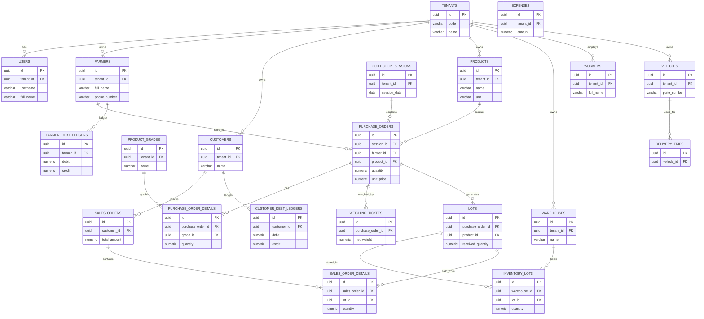

# 05. ERD Diagram (Mermaid) – Trader SaaS Database

Tài liệu này cung cấp **ERD (Entity Relationship Diagram)** cho hệ thống SaaS quản lý thương lái nông sản.

Sơ đồ được viết bằng **Mermaid**, có thể render trực tiếp trên:

- GitHub
- GitLab
- Notion
- Obsidian
- Mermaid Live Editor
- Confluence (plugin)

---

# 1. ERD Tổng thể

---

# 2. Luồng nghiệp vụ chính

## Thu mua

Farmer  
→ Purchase Order  
→ Weighing Ticket  
→ Lot

## Kho

Lot  
→ Inventory Lots  
→ Warehouse

## Bán hàng

Inventory Lot  
→ Sales Order  
→ Sales Order Detail

## Công nợ

Purchase Order  
→ Farmer Debt Ledger

Sales Order  
→ Customer Debt Ledger

---

# 3. Cách render ERD

Bạn có thể:

### Cách 1

Copy vào:

https://mermaid.live

### Cách 2

Đặt trong file `.md` trên GitHub.

GitHub sẽ tự render.

### Cách 3

Import vào Notion / Obsidian.

---

# 4. Lợi ích của ERD này

Giúp team:

- hiểu cấu trúc database nhanh
- dễ review schema
- dễ mở rộng feature

---

# 5. Mở rộng trong tương lai

Có thể bổ sung thêm:

- logistics tables
- payroll tables
- qc tables
- analytics tables
